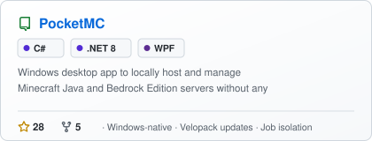
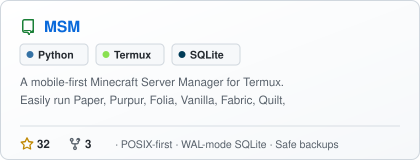
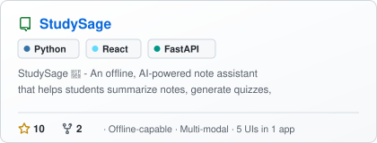
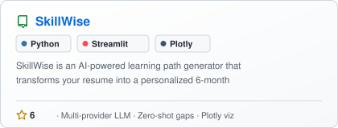
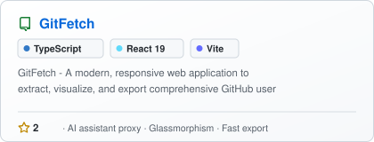
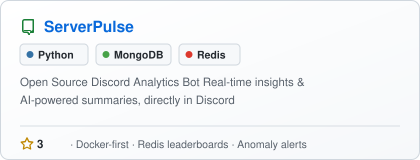

  

<!-- Typing Intro -->

  

<!-- Social / Contact Badges -->

  
  
  

  

---

  

---

## Tech Stack

<table>
  <tr>
    <td align="center" width="130"><b>Languages</b></td>
    <td>
      
      
      
      
      
      
      
      
    </td>
  </tr>
  <tr>
    <td align="center"><b>Frameworks & UI</b></td>
    <td>
      
      
      
      
      
      
      
      
    </td>
  </tr>
  <tr>
    <td align="center"><b>AI / ML</b></td>
    <td>
      
      
      
      
      
      
      
      
    </td>
  </tr>
  <tr>
    <td align="center"><b>Databases</b></td>
    <td>
      
      
      
      
      
    </td>
  </tr>
  <tr>
    <td align="center"><b>Tools & Platforms</b></td>
    <td>
      
      
      
      
      
      
      
      
    </td>
  </tr>
  <tr>
    <td align="center"><b>Utilities</b></td>
    <td>
      
      
      
      
      
      
    </td>
  </tr>
</table>

---

## Featured Work

<table>
  <tr>
    <td width="50%" align="center">
      
    </td>
    <td width="50%" align="center">
      
    </td>
  </tr>
  <tr>
    <td width="50%" align="center">
      
    </td>
    <td width="50%" align="center">
      
    </td>
  </tr>
  <tr>
    <td width="50%" align="center">
      
    </td>
    <td width="50%" align="center">
      
    </td>
  </tr>
</table>

<b> More Projects & Experiments</b>

 

| Project | Stack | Description |
|---|---|---|
| [ReleaseWave](https://github.com/sizwinz/releasewave) | Python · PyPI | Agentic changelog generator that reads real git diffs, smart-chunks them, and outputs developer / user / tweet formats |
| [YtOP](https://github.com/sizwinz/YtOP) | Python · JS · Tampermonkey | YouTube enhancement suite bridging a Tampermonkey userscript with a multi-threaded Python, yt-dlp, and FFmpeg backend |
| [Hypixel SkyBlock Extractor](https://github.com/sizwinz/Hypixel-SkyBlock-Profile-Extractor) | Python · Streamlit | Secure Hypixel API v2 data extraction for AI-powered game analytics |
| [Campus Assistant](https://github.com/DS-labs-op/campus-assistant) | Python · FastAPI · Next.js | Multilingual RAG chatbot for educational institutions (7+ Indian languages) |
| [Mighty Fines](https://github.com/sizwinz/mighty-fines) | Next.js · Stripe · Twilio | Conversion-focused membership platform with tiered Stripe subscriptions and lifecycle SMS |
| [SaaS Inspector](https://github.com/sizwinz/SaaS-Inspector) | TypeScript | Evidence-backed micro-SaaS idea validation engine |

---

  

---

  

---

## Contact Me

  
  

  

---

## Quotes I Live By

| Quote | Author |
|-------|--------|
| Are you doing things right now that will make your 8-year-old and 80-year-old self proud? | Varun Mayya |
| Give people wonderful tools and they'll do wonderful things. | Apple |
| Ever tried? Ever failed? No matter. Try again. Fail again. Fail better. | Samuel Beckett |
| I think it's very important to have a feedback loop, where you're constantly thinking about what you've done and how you could be doing it better. | Elon Musk |

---

  

  

